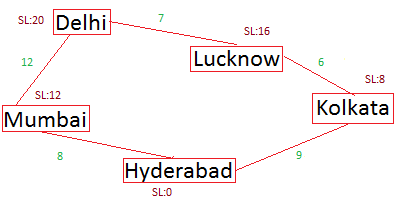
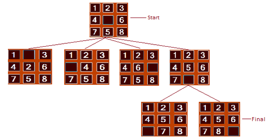

# 8/15 Puzzle using A* (A Star) Algorithm

This project solves the 8 puzzle problem using A* algorithm. Project has been implemented in C# with a graphical interface that allows a person to play the game or find an optimal solution for current state of the 8 puzzle. I wrote the first post on CodeProject [here](https://www.codeproject.com/Articles/616874/8-15-Puzzle-using-A-A-Star-Algorithm-Csharp)

## A* Algorithm

A* ("A Star") algorithm is an informed search strategy - strategy that uses problem specific knowledge, deriving from the problem itself. In other words, it is a best-first search algorithm that evaluates the next possible path based on the total estimated cost. It always looks for the cheapest path among the possible paths and tries to reach towards the goal.

### Background
So how does A* knows which one is the cheapest path? Let's take an example to see this.

The map below shows the connecting paths between five different cities in India. If a person has to travel from one city to another, We know the actual distance that a person has to cover (numbers in green color). The travel distance from Delhi -> Mumbai is 12, Delhi -> Lucknow is 7, Mumbai -> Hyderabad is 8, Lucknow -> Kolkata is 6, and Kolkata -> Hyderabad is 9.

In real world, probably you would know the total distance that you might have to travel to reach to Hyderabad from all possible routes and you will choose the one where you see the minimum distance you have to cover. This is pretty easy when person has information about all states - from start to the final destination.

The challenge comes into the picture when you have no idea about the next destination unless you actually reach there i.e. when you have to actually discover the path from one point to another point and you don't know the state unless you are in that state. This type of search is known as uniformed search - there is no other information other than the problem definition itself. For example, you don't know that there is a path from Mumbai to Hyderabad unless you reach at Mumbai.

Now, say along with the actual distance between Delhi and Mumbai, we also know the straight line distance of each city to Hyderabad - the shortest path, always less than or equal to the actual distance from current city to Hyderabad (known as Heuristic for A* algorithm).

For easy notation - we will call actual distance from one city to another as g.

And straight line distance from Hyderabad to any other city as h.

As you have noticed, heuristic cost h is not overestimating the cost g (h <= g; a very important thing for A* to converge).

Now we will say distance of moving from one city to another city is sum of actual distance (g) and straight line distance (h):

f = g + h.

This distance (f) is used by the algorithm to determine the cheapest path. So, a path which has lower value of f would be preferred over the one with higher value of f.

Now, using the above distance formula, we can figure out how A* is going to search the optimal path from Delhi to Hyderabad.

Straight line distance to Hyderabad:

Delhi: 20, Mumbai: 12, Lucknow: 16, Kolkata: 8, Hyderabad: 0

f(Delhi -> Mumbai)  = 20 + 12 = 32

f(Delhi -> Lucknow) = 20 + 7 = 27

Since Delhi to Lucknow has lower value of f, next path to expand is Lucknow to Kolkata.

f(Lucknow -> Kolkata) = 27 + 16 + 6 = 49.

Now we have two open states (Delhi -> Mumbai) and (Lucknow -> Kolkata). One with lowest value of f will be explored further (f(Delhi -> Mumbai) = 32).

f(Mumbai -> Hyderabad) = 32 + 12 + 8 = 52

Next path to examine is (Delhi -> Lucknow -> Kolkata).

f(Kolkata -> Hyderabad): 49 + 8 + 9 = 66

Now that it has reached to the destination, and it has cheapest path among possible paths is one from Delhi -> Mumbai -> Hyderabad. It will backtrack and declare this path as an optimal path.

One thing worth mentioning here is it does not expand all possible paths to the destination.

It always expands those one that seems optimal. For example, if there would have been a path from Kolkata -> Bhubaneswar -> Hyderabad and total cost reaching to Kolkata -> Bhubaneswar > 52, A* won't even bother to examine the path at all. It knows that there exist a path to the final destination with f value = 52 and f value to Bhubaneswar is more than 52.

## 8/15 Puzzle

So how does 8/15 puzzle can be solved using this path finding algorithm?

Let's talk about 8 puzzle - simple sliding tiles on a 3x3 grid. You are allowed to move along with empty block, one step at a time. The puzzle is said to be solved, when it has sequential arrangement of the numbers.

So you have a start state (some random arrangement), and then a final state to reach.

This is how you start solving the puzzle:

1. Get the first state, which is your start state.
2. Get all the possible states in which puzzle can be.
3. Add these new states in open state list
4. Add processed sate in the closed list
5. Pick the next state which has the lowest cost in the open list
6. Start repeating the steps from 1 to 6 unless you are into the final state, or no more states to examine (in this case, no solution exists).
7. Once you have the final state, backtrack to the start node and that would be the optimal path to find the solution.

### Puzzle Heuristic

So what should be the g and h cost for this problem?

Since each time you just move one tile by one block, you can say actual move cost (g) is 1 from moving one state to another. For 8 puzzle, total states that grid could be is !9/2 = 181,440. So you really need an optimal way to determine you are reaching towards the goal and without exploring unnecessary states.

There are two common h cost (it is known as Heuristic cost):

1. Number of misplaced tiles - you can count the number of tiles which are misplaced, for a particular sate. When you are into final sate, h = 0.
2. Sum of distances of the tiles from their actual positions (Manhattan distance) - sum of horizontal and vertical distances, for each tile.

Second heuristic converges faster than the first one.

## Implementation

You need to maintain the parent information to maintain the tree so that it can be backtracked. Also, you need to maintain a list of open and closed nodes so that you won't examine the one which have been examined earlier and avoid falling in loop. You probably want to maintain the open nodes using Min Priority Queue data structure so that you can get the next state to examine quickly. It can be done without Min Priority Queue as well - but that would be too slow.
You also need Hash tables to quickly find closed / open nodes.

I have implemented this in C#. you need .NET 4.0 installed on your machine to run the application.

You can shuffle the arrangements and change the heuristic from the menu. On average, it's taking ~44 seconds (using misplaced tiles heuristic) to tell if no solution exists for the arrangement (i.e. no way this puzzle can be solved).

Last thing - I didn't lie when I added 15 puzzle in the list. Same code can be used to extend the solution for 15 puzzle game. In fact, you just need to change the grid from 3x3 to 4x4. But this would be too slow for 15 puzzle. 15 puzzle can be in 10^13 states, which is too slow for A* algorithm to handle. There exists a better version of it; I will talk, when I have it.

### Revised code

I have optimized code to use indexed min priority queue. This is to speed-up the lookup and removal of the state from the min priority queue.

This code is taking ~3.85 seconds to converge if there is no solution for the puzzle, which is ~11 times faster than previous version.